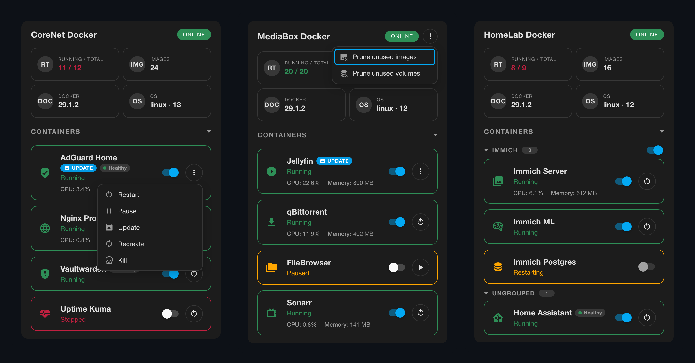
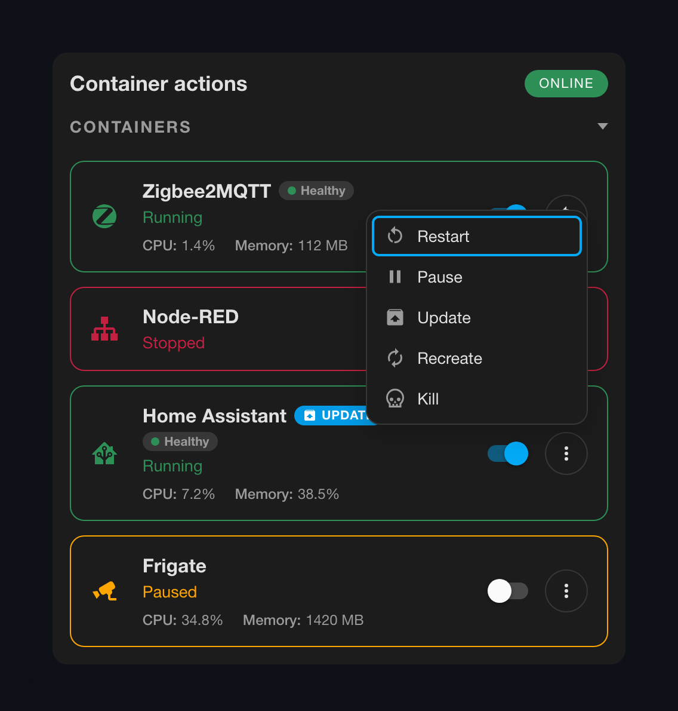
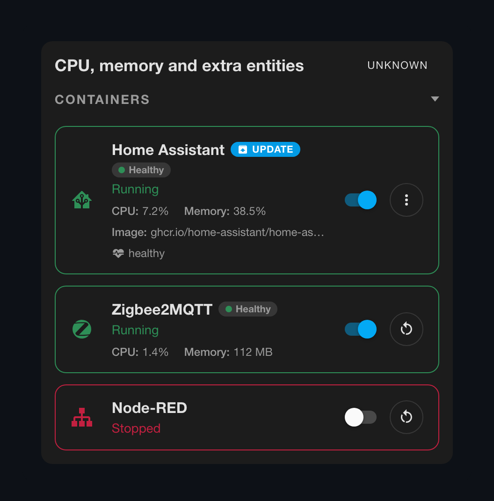
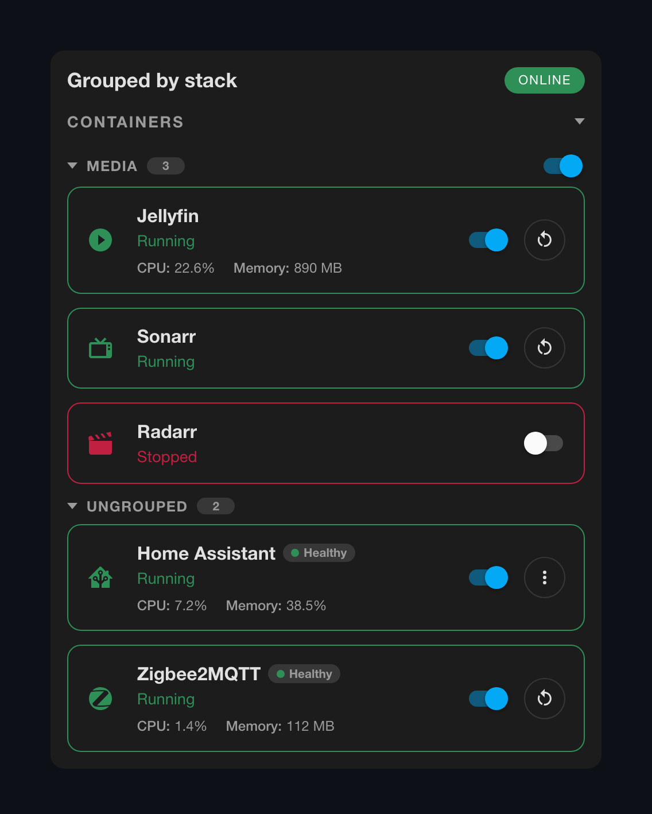
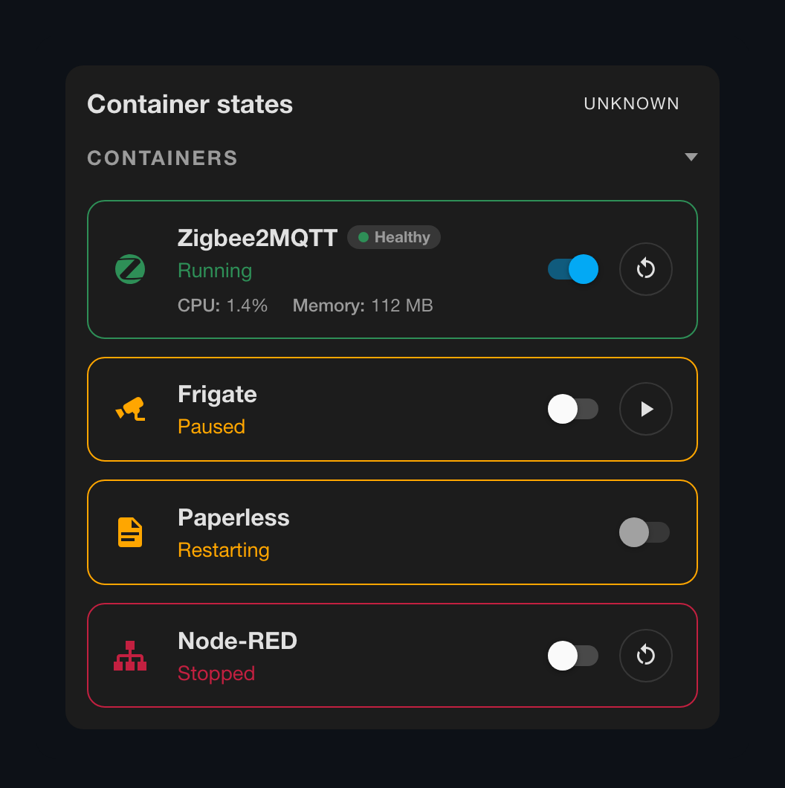
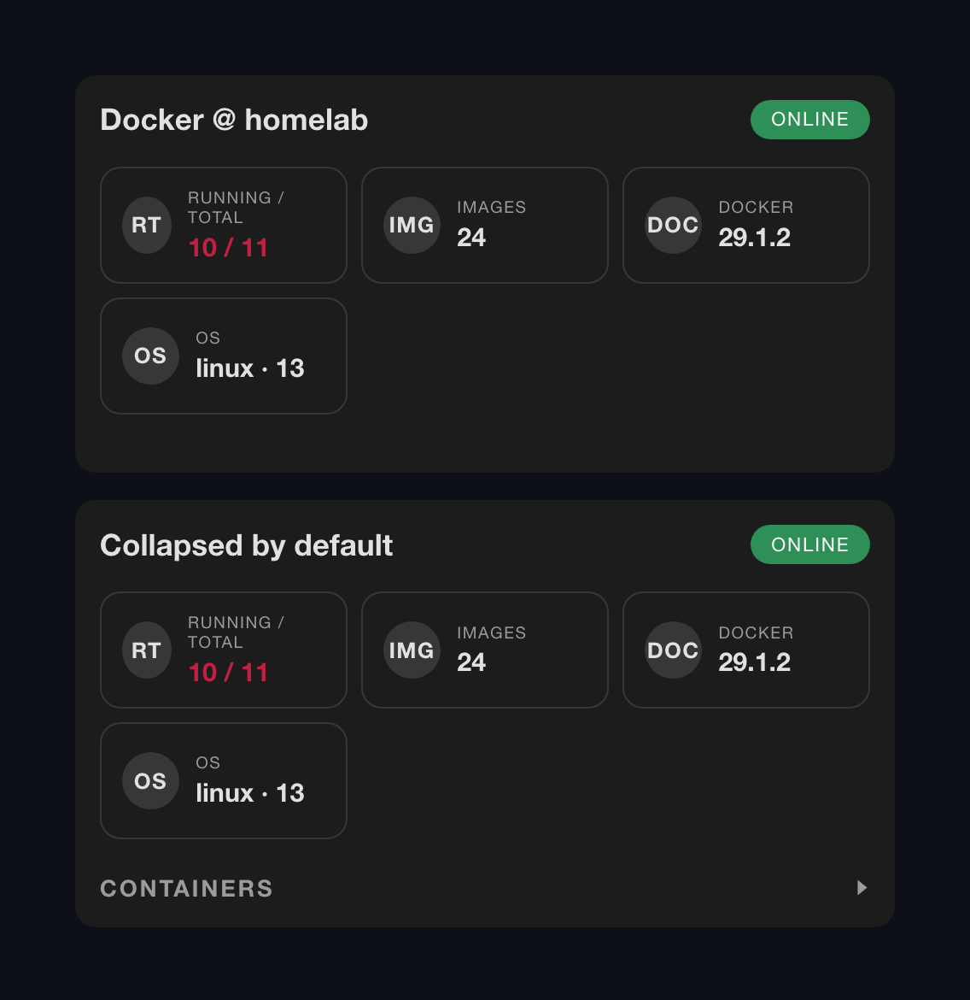
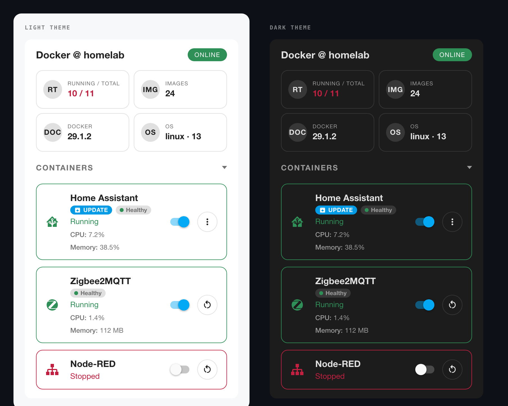

# Docker Card

A Lovelace card to monitor and control your Docker containers from Home Assistant. Point it at the official [Portainer integration](https://www.home-assistant.io/integrations/portainer/) and it builds itself, every container, its controls, resource usage and image updates, with no templates or shell commands.



## Contents

- [Features](#features)
- [Requirements](#requirements)
- [Installation](#installation)
- [Quick start](#quick-start)
  - [With Portainer (auto-discovery)](#with-portainer-auto-discovery)
  - [Without auto-discovery](#without-auto-discovery)
- [Configuration reference](#configuration-reference)
  - [Card options](#card-options)
  - [`auto_discover` options](#auto_discover-options)
  - [`docker_overview` options](#docker_overview-options)
  - [Container options](#container-options)
- [Features in depth](#features-in-depth)
  - [Auto-discovery](#auto-discovery)
  - [Custom Portainer URL](#custom-portainer-url)
  - [Container actions](#container-actions)
  - [Image updates](#image-updates)
  - [CPU, memory and extra entities](#cpu-memory-and-extra-entities)
  - [Icons](#icons)
  - [Grouping by stack](#grouping-by-stack)
  - [Container states](#container-states)
  - [Hiding the container list](#hiding-the-container-list)
  - [Styling and theming](#styling-and-theming)
- [Exposing Docker without Portainer](#exposing-docker-without-portainer)
- [Troubleshooting](#troubleshooting)
- [Development](#development)
- [License](#license)

## Features

- **Auto-discovery:** one line of YAML builds the whole card from the Portainer integration
- Compact overview of your Docker host: container counts, image count, version, OS and daemon state
- Start, stop, restart, pause, resume, kill and recreate
- Image-update badge per container, installable from the card
- Per-container CPU and memory usage, plus any other entity you want on the row
- Optional grouping by Compose stack, with a switch for the whole stack
- Optional per-container icons and health badges
- Theme-aware styling with configurable running vs not-running accent colors
- Tap and hold actions per row for more-info, navigation, URLs or service calls

## Requirements

- Latest version of Home Assistant
- Docker managed via the official **Portainer** integration
- Or, for non-Portainer setups, equivalent entities you create yourself
  (see [Exposing Docker without Portainer](#exposing-docker-without-portainer))

> [!IMPORTANT]
> This card **does not** talk to Docker directly. It visualises entities exposed through the standard Home Assistant entity model.

## Installation

### 1. Via HACS (recommended)
Installation is easiest via the [Home Assistant Community Store (HACS)](https://hacs.xyz/), which is the best place to get third-party integrations for Home Assistant. Once you have HACS set up, simply click the button below (requires My Homeassistant configured) or follow the [instructions for adding a custom repository](https://hacs.xyz/docs/faq/custom_repositories) and then locate **Docker Card** under **Frontend** and install it.

[](https://my.home-assistant.io/redirect/hacs_repository/?owner=vineetchoudhary&repository=lovelace-docker-card&category=dashboard)

### 2. Manual install

1. Copy `docker-card.js` to your Home Assistant `/config/www/docker-card/` folder.
2. Add the resource through **Settings → Dashboards → Resources → +**:
   ```yaml
   url: /local/docker-card/docker-card.js
   type: module
   ```
3. Reload the browser cache (`Ctrl/Cmd + Shift + R`).

## Quick start

### With Portainer (auto-discovery)

Install the **Portainer** integration (Settings → Devices & Services → + → Portainer), then add a manual card with this configuration:

```yaml
type: custom:docker-card
title: Docker @ homelab
auto_discover: true
containers_expanded: true
```

That is the whole card. Every container is found automatically, along with its state sensor, switch, lifecycle buttons, image-update entity, CPU, memory and health sensors.

From there, refine it as much as you like:

```yaml
type: custom:docker-card
title: Docker @ homelab
containers_expanded: true
group_by: stack                 # group containers under their Compose stack
show_icons: true                # give every row an icon
auto_discover:
  endpoint: Local               # limit to one Portainer endpoint
  exclude: ["*-db", "watchtower"]
  sort: name
containers:                     # optional per-container tweaks, matched by name
  - name: zigbee2mqtt
    icon: mdi:zigbee
```

### Without auto-discovery

Every option can also be wired up by hand. It is useful for non-portainer setups, or when you want a curated list rather than everything:

```yaml
type: custom:docker-card
title: Docker @ homelab
containers_expanded: true
docker_overview:
  status: binary_sensor.docker_daemon_status
  container_count: sensor.docker_containers_total
  containers_running: sensor.docker_containers_running
  containers_stopped: sensor.docker_containers_stopped
  image_count: sensor.docker_images
  docker_version: sensor.docker_version
  operating_system: sensor.host_os
  operating_system_version: sensor.host_os_version
containers:
  - name: Home Assistant
    icon: mdi:home-assistant
    status_entity: sensor.homeassistant_state
    control_entity: switch.homeassistant
    restart_entity: button.homeassistant_restart
    cpu_entity: sensor.homeassistant_cpu
    memory_entity: sensor.homeassistant_memory
  - name: Node-RED
    icon: mdi:sitemap
    status_entity: sensor.nodered_state
    control_entity: switch.nodered
    restart_entity: button.nodered_restart
```

## Configuration reference

### Card options

| Option | Required | Description |
| --- | --- | --- |
| `type` | **Yes** | `custom:docker-card` |
| `auto_discover` | Conditional | `true`, or a map of [options](#auto_discover-options). Required unless you list `containers` yourself |
| `containers` | Conditional | List of containers, or a single container object. Required unless `auto_discover` is set; may also refine discovered rows |
| `title` | No | Card header. Defaults to “Docker Card” |
| `containers_expanded` | No | `true` to expand the container list on load, `false` (default) to collapse it |
| `docker_overview` | No | Host stats to show, see [options](#docker_overview-options). Filled in by auto-discovery |
| `group_by` | No | `none` (default) or `stack` — see [Grouping by stack](#grouping-by-stack) |
| `stacks` | No | Per-stack settings keyed by stack name, e.g. `media: { control_entity: switch.media_stack }` |
| `primary_action` | No | `auto` (default), `none`, or an action name — see [Container actions](#container-actions) |
| `actions` | No | Which actions may be offered at all. Defaults to all of them |
| `confirm_actions` | No | Actions needing a second click. Defaults to `kill`, `recreate`, `update`; `[]` disables |
| `show_containers` | No | `auto` (default), `true`, `false` — see [Hiding the container list](#hiding-the-container-list) |
| `show_icons` | No | `auto` (default), `true`, `false` — see [Icons](#icons) |
| `show_update_badge` | No | `false` hides the image-update badge |
| `show_health` | No | `false` hides the health badge |
| `show_host_actions` | No | `false` hides the header menu with the prune buttons |
| `running_color` | No | Accent color for running containers and the status pill |
| `not_running_color` | No | Accent color for containers that are not running |
| `running_states` | No | States counting as “running”. Defaults to `running, on, started, up` |
| `stopped_states` | No | States counting as “stopped”. Defaults to `stopped, off, exited, down, inactive, dead, created` |
| `transitional_states` | No | States counting as in-between. Defaults to `restarting, removing, paused, starting` |
| `stopped_color` | Legacy | Alias for `not_running_color` |

### `auto_discover` options

`auto_discover: true` is shorthand for all defaults. Pass a map to narrow it down — every key is
optional:

| Option | Default | Description |
| --- | --- | --- |
| `integration` | `portainer` | Integration to read containers from. Devices and entities belonging to any other integration are ignored |
| `endpoint` | *all* | Limit to one Portainer endpoint, by device name or device id. With several endpoints and no value set, containers from all of them are listed but the overview is skipped |
| `stack` | *all* | Only containers belonging to this stack, by stack name or device id |
| `area` | *all* | Only containers in this area, by area name, alias or id |
| `include` | *all* | Name globs to include, e.g. `["media-*", "*arr"]`. `*` and `?` are supported |
| `exclude` | *none* | Name globs to exclude. Exclusions win over inclusions |
| `sort` | `name` | Row order: `name`, `state` or `cpu` (busiest first) |
| `overview` | `true` | Fill `docker_overview` from the endpoint device. A `docker_overview` you write yourself always wins |
| `base_url` | *integration's own URL* | Scheme, host and port to use for those links, e.g. `https://portainer.example.com`. Useful when Portainer is configured by IP but you reach it on a domain — see [Custom Portainer URL](#custom-portainer-url) |
| `link_to_portainer` | `true` | Give each row a `hold_action` opening that container's page in Portainer |
| `include_hidden` | `false` | Include entities hidden in the Home Assistant entity registry |

```yaml
auto_discover:
  integration: portainer
  endpoint: Local
  stack: media
  area: Server rack
  include: ["*"]
  exclude: ["*-db", "watchtower"]
  sort: cpu
  overview: true
  link_to_portainer: true
  base_url: https://portainer.example.com
  include_hidden: false
```

### `docker_overview` options

Each key is optional, and every pill is independent it renders when its entity exists and has a usable state, and quietly disappears when it does not. One unavailable sensor never hides the others, and if all of them are unavailable the grid disappears while the container list carries on as normal.

| Option | Shown as | Description |
| --- | --- | --- |
| `status` | Header pill | Daemon state. `on`/`running`/`online`/`ok`/`ready` reads **Online**, `off`/`offline`/`error`/`problem`/`down` reads **Offline**, anything else is idle |
| `container_count` | Running / Total | Total containers |
| `containers_running` | Running / Total | Running containers. The pill turns the not-running color when running ≠ total |
| `containers_stopped` | Running / Total | Stopped containers. Used to derive the total when `container_count` is absent |
| `image_count` | Images | Number of images |
| `docker_version` | Docker | Docker version |
| `operating_system` | OS | Host OS |
| `operating_system_version` | OS | Host OS version, joined as `name · version` |
| `prune_images` | Header menu | Button that prunes unused images |
| `prune_volumes` | Header menu | Button that prunes unused volumes |

### Container options

| Option | Description |
| --- | --- |
| `name` | Label for the row. Defaults to the status entity's friendly name |
| `icon` | Icon before the name, e.g. `mdi:calendar`. `none` hides it for this row |
| `status_entity` | Entity whose state represents the container status |
| `control_entity` | Entity supporting `turn_on`/`turn_off` (`switch`, `input_boolean`, `light`, `fan`, `script`, `automation`) used to start and stop |
| `start_service` / `stop_service` | Services to call instead of `control_entity`, as `domain.service` or an object with `domain`, `service` and optional `data`/`entity_id`/`target` |
| `restart_entity` | Entity that restarts the container. `button` → `press`, `script`/`switch` → `turn_on`, `automation` → `trigger` |
| `pause_entity` | Entity that pauses the container |
| `resume_entity` | Entity that resumes a paused container |
| `kill_entity` | Entity that kills the container |
| `recreate_entity` | Entity that recreates the container |
| `<action>_domain` | Override the domain used for any action entity |
| `<action>_service` | Call a service instead of pressing an entity, for any action |
| `update_entity` | `update` entity for the container image |
| `update_action` | What the update badge does: `more-info` (default), `install`, `none` |
| `health_entity` | Sensor reporting `healthy` / `unhealthy` / `starting` |
| `cpu_entity` | Sensor holding CPU usage |
| `memory_entity` | Sensor holding memory usage |
| `extra_entities` | Any other entities to show on the row — string, or `{entity, name, icon}` |
| `stack` | Stack this container belongs to, used by `group_by: stack`. Set by auto-discovery |
| `primary_action` / `actions` | Per-container overrides of the card-level settings |
| `running_states` / `stopped_states` / `transitional_states` | Per-container state lists |
| `running_color` / `not_running_color` | Per-container accent overrides |
| `tap_action` / `hold_action` | Standard Lovelace actions: `more-info` (default), `toggle`, `navigate`, `url`, `call-service`, `fire-dom-event`, `none` |
| `hold_delay` | Hold detection delay in ms. Defaults to 500 |
| `id` | Stable row identifier. Only needed when two containers share a name and entities |
| `switch_entity` / `switch_domain` / `stopped_color` | Legacy aliases for `control_entity` / `control_domain` / `not_running_color` |

> [!TIP]
> `sensor` and `binary_sensor` entities are read-only. Use a `switch`, `input_boolean` or similar for `control_entity`, or the row's switch stays disabled.

## Features in depth

### Auto-discovery

```yaml
type: custom:docker-card
auto_discover: true
containers_expanded: true
```

The card reads Home Assistant's device and entity registries, finds every device belonging to the Portainer integration, and maps its entities onto the card:

| Discovered | Used as |
| --- | --- |
| Container state sensor | Row status |
| Container switch | Start / stop |
| Restart, pause, resume, kill, recreate buttons | [Container actions](#container-actions) |
| Image update entity | [Update badge](#image-updates) |
| CPU, memory and health sensors | [Resource line](#cpu-memory-and-extra-entities) and health badge |
| Image sensor | Extra entity on the row |
| Stack device | [Grouping](#grouping-by-stack) and the stack switch |
| Endpoint device | `docker_overview` and the prune buttons |

Entities are matched on the integration's `translation_key`, never on entity IDs — IDs are generated from names in your own language, so a German or French install discovers exactly the same way.

Discovered rows can still be refined by hand. A `containers:` entry whose `name` matches a discovered container is merged on top of it, and anything that matches nothing is kept as an ordinary manual row:

```yaml
auto_discover: true
containers:
  - name: zigbee2mqtt        # refines the discovered row
    icon: mdi:zigbee
    tap_action:
      action: navigate
      navigation_path: /lovelace/zigbee
```

Discovery only re-runs when the registries actually change, not on every state update, so a container added in Portainer appears without a dashboard reload. If your Home Assistant does not expose the registries to custom cards, the card logs a warning and falls back to whatever `containers:` you wrote.

#### Custom Portainer URL

Each discovered row links back to its container in Portainer, using the URL the integration was set up with  an local address like `http://192.168.1.10:9000`. If you reach Portainer somewhere else, point `base_url` at it:

```yaml
auto_discover:
  base_url: https://portainer.example.com
```

The scheme, host and port are replaced while the container route is kept, so `https://172.16.10.10:9443/#!/2/docker/containers/abc` becomes:

| `base_url` | Resulting link |
| --- | --- |
| `https://portainer.example.com` | `https://portainer.example.com/#!/2/docker/containers/abc` |
| `https://portainer.example.com:8443` | `https://portainer.example.com:8443/#!/2/docker/containers/abc` |
| `portainer.example.com` | `https://portainer.example.com/#!/2/docker/containers/abc` |
| `https://home.example.com/portainer` | `https://home.example.com/portainer/#!/2/docker/containers/abc` |

A `base_url` with no port drops the original one and uses the default for the scheme, so give it an explicit port if your domain needs one. A bare host is assumed to be `https`, a path is honoured for reverse proxies, and an unparseable value leaves the original link untouched.

### Container actions



The switch starts and stops the container. Everything else sits behind a single `⋮` button, so the row keeps its width no matter how many actions a container supports.

| `primary_action` | Behaviour |
| --- | --- |
| `auto` (default) | One available action renders as a direct icon button — a menu would cost the same width and an extra click. Two or more collapse into the `⋮` menu |
| `none` | Always use the menu, even for a single action |
| an action name | That action gets the button, the rest go in the menu. `restart` yields to `Resume` on a paused container |

`primary_action` and `actions` are card-level options that apply to every container, and either can be overridden on an individual container:

```yaml
type: custom:docker-card
auto_discover: true
primary_action: restart          # every row gets a restart button
containers:
  - name: frigate
    primary_action: none         # …except this one, which keeps everything in the menu
```

**Actions appear only when they can run.** The card reads each action entity's own availability, and Portainer already marks a button `unavailable` when the action does not apply. You cannot pause a stopped container, or restart a paused one. A container with no available actions shows no button at all.

`kill`, `recreate` and `update` ask for confirmation: the menu item arms on the first click and fires on the second, disarming after a few seconds. Change that with `confirm_actions`, or set `confirm_actions: []` to fire immediately. Host-level prune buttons live behind a `⋮` in the card header and are confirm-gated the same way.

For non-Portainer setups every action takes a plain service instead:

```yaml
containers:
  - name: Zigbee2MQTT
    status_entity: sensor.zigbee2mqtt_state
    restart_service: shell_command.docker_restart_z2m
    pause_service: shell_command.docker_pause_z2m
```

### Image updates

Point `update_entity` at an `update` entity and a container with a pending image update shows an **Update** badge next to its name:

```yaml
containers:
  - name: Home Assistant
    status_entity: sensor.homeassistant_state
    update_entity: update.homeassistant_image
    update_action: more-info      # more-info (default) | install | none
```

Clicking the badge opens the more-info dialog, which is where Home Assistant offers its own install button. `update_action: install` installs directly instead, and the `⋮` menu always carries an explicit **Update** item. While an install runs the row is marked pending and shows `Installing… 42%` when the entity reports progress. This progress comes from the entity, not a timer, so it stays accurate for a recreate that takes minutes.

> Portainer reports image versions as sha256 digests rather than version numbers, so the card never prints them inline; the before/after digests are truncated into the badge's tooltip.

### CPU, memory and extra entities



`cpu_entity` and `memory_entity` are shorthands for the two most common cases. Anything else goes in `extra_entities`:

```yaml
containers:
  - name: Home Assistant
    status_entity: sensor.homeassistant_state
    cpu_entity: sensor.homeassistant_cpu
    memory_entity: sensor.homeassistant_memory
    extra_entities:
      - sensor.homeassistant_image                # string form
      - entity: sensor.homeassistant_health       # object form
        icon: mdi:heart-pulse                     # replaces the text label
```

- Numeric values follow the sensor's own `unit_of_measurement`: a `%` sensor renders as `38.5%`, anything else keeps its unit `512 MB`. CPU and memory with no unit are assumed to be percentages; an extra entity with no unit is shown as a plain number.
- Non-numeric states are shown as-is, so image tags and version strings survive intact.
- Labels default to the entity's friendly name with the container name stripped off the front, so `Home Assistant Image` reads `Image`. Use `name` to override, or `icon` to replace it.
- `unknown`, `unavailable` and missing entities are skipped. With nothing usable, the line disappears.

### Icons

```yaml
show_icons: true
containers:
  - name: Calendar
    icon: mdi:calendar
    status_entity: sensor.calendar_state
```

The icon sits before the name and takes the row's running / not-running color. Per row it resolves as `containers[].icon` → the status entity's `icon` attribute → the control entity's `icon` attribute → `mdi:docker`. Set `icon: none` to opt a single row out.

| `show_icons` | Behaviour |
| --- | --- |
| `auto` (default) | Only icons you actually configured, either through `containers[].icon` or a custom `icon` on the entity. Existing dashboards are unchanged |
| `true` | Always show one, falling back to `mdi:docker` |
| `false` | Never show icons, even where `icon` is set |

When any row has an icon, rows without one reserve the same space so the list stays aligned.

### Grouping by stack



`group_by: stack` lists containers under a collapsible heading per stack, with a count and a switch that starts or stops the whole stack:

```yaml
type: custom:docker-card
auto_discover: true
group_by: stack
containers_expanded: true
```

Auto-discovery fills in each container's stack from the Portainer device tree and picks up the stack's switch. Without discovery, group by hand and point the switch at an entity yourself:

```yaml
group_by: stack
stacks:
  media:
    control_entity: switch.media_stack
containers:
  - name: Jellyfin
    stack: media
    status_entity: sensor.jellyfin_state
  - name: Home Assistant
    status_entity: sensor.homeassistant_state
```

Groups sort by name, containers with no stack collect under **Ungrouped** (always last), and each group collapses independently. If nothing has a stack the card renders a flat list, so turning `group_by` on is never destructive.

### Container states



Docker containers are not simply running or stopped, so states fall into three buckets:

| Bucket | Default states | Appearance |
| --- | --- | --- |
| Running | `running`, `on`, `started`, `up` | Running accent color |
| Stopped | `stopped`, `off`, `exited`, `down`, `inactive`, `dead`, `created` | Not-running accent color |
| Transitional | `restarting`, `removing`, `paused`, `starting` | Warning color |

Anything else is shown as-is with the not-running styling. The switch is disabled while a container is mid-flight (`restarting`, `removing`, `starting`) but stays usable when it is merely `paused` — stopping a paused container is perfectly valid. Override any bucket with `running_states`, `stopped_states` or `transitional_states`, globally or per container.

### Hiding the container list



| `show_containers` | Behaviour |
| --- | --- |
| `auto` (default) | Hides the section when there are no containers **and** the card still has an overview to show |
| `true` | Always render it, including the “No containers configured.” hint |
| `false` | Never render it — an overview-only card |

```yaml
type: custom:docker-card
show_containers: false
docker_overview:
  status: binary_sensor.docker_daemon_status
  container_count: sensor.docker_containers_total
  containers_running: sensor.docker_containers_running
```

`auto` only hides the section when the card has something else to display — with no containers *and* no overview the hint stays, so a broken configuration is visible instead of a blank box.

### Styling and theming



- **Accent colors:** override `running_color` and `not_running_color` globally, or per container to highlight critical services. They fall back to your theme (`--state-active-color`, `--state-error-color`) and then to the card's own defaults.
- **Running/Total highlight:** the overview pill turns the not-running color whenever the counts diverge.
- **Compact controls:** actions are round icon buttons and collapse into one `⋮` past the first, so the row width is the same whether a container offers one action or six. A restart button keeps the `restart-button` class, so existing `card_mod` styling still applies.
- **Narrow columns:** below a card width of 360px the switch and buttons drop to their own line instead of squeezing the container name.
- **Theme alignment:** typography, spacing and background come from your current Home Assistant theme.

## Exposing Docker without Portainer

For environments that do not use Portainer, the example below shows how to surface equivalent entities with `command_line` sensors and `shell_command` helpers. Adjust container names to match your setup.

```yaml
# configuration.yaml or a dedicated package
sensor:
  - platform: command_line
    name: docker_containers_total
    command: "docker info --format '{{.Containers}}'"
    scan_interval: 60
  - platform: command_line
    name: docker_containers_running
    command: "docker info --format '{{.ContainersRunning}}'"
    scan_interval: 60
  - platform: command_line
    name: docker_containers_stopped
    command: "docker info --format '{{.ContainersStopped}}'"
    scan_interval: 60
  - platform: command_line
    name: docker_images
    command: "docker info --format '{{.Images}}'"
    scan_interval: 300
  - platform: command_line
    name: docker_version
    command: "docker version --format '{{.Server.Version}}'"
    scan_interval: 3600
  - platform: command_line
    name: docker_homeassistant_status
    command: "docker inspect -f '{{.State.Status}}' homeassistant"
    scan_interval: 30
  - platform: command_line
    name: docker_nodered_status
    command: "docker inspect -f '{{.State.Status}}' nodered"
    scan_interval: 30
  - platform: command_line
    name: docker_homeassistant_cpu
    command: "docker stats homeassistant --no-stream --format '{{.CPUPerc}}' | tr -d '%'"
    unit_of_measurement: "%"
    scan_interval: 60
  - platform: command_line
    name: docker_homeassistant_memory
    command: "docker stats homeassistant --no-stream --format '{{.MemPerc}}' | tr -d '%'"
    unit_of_measurement: "%"
    scan_interval: 60

binary_sensor:
  - platform: command_line
    name: docker_daemon_status
    command: "docker info > /dev/null && echo 'on' || echo 'off'"
    device_class: connectivity
    scan_interval: 30

shell_command:
  docker_start_homeassistant: "docker start homeassistant"
  docker_stop_homeassistant: "docker stop homeassistant"
  docker_restart_homeassistant: "docker restart homeassistant"
  docker_start_nodered: "docker start nodered"
  docker_stop_nodered: "docker stop nodered"
  docker_restart_nodered: "docker restart nodered"

script:
  docker_start_homeassistant:
    alias: Start Home Assistant container
    sequence:
      - service: shell_command.docker_start_homeassistant
  docker_stop_homeassistant:
    alias: Stop Home Assistant container
    sequence:
      - service: shell_command.docker_stop_homeassistant
  docker_restart_homeassistant:
    alias: Restart Home Assistant container
    sequence:
      - service: shell_command.docker_restart_homeassistant
  docker_start_nodered:
    alias: Start Node-RED container
    sequence:
      - service: shell_command.docker_start_nodered
  docker_stop_nodered:
    alias: Stop Node-RED container
    sequence:
      - service: shell_command.docker_stop_nodered
  docker_restart_nodered:
    alias: Restart Node-RED container
    sequence:
      - service: shell_command.docker_restart_nodered

```

To expose toggle-friendly entities, you can wrap the same shell commands in `command_line` switches or template buttons:

```yaml
switch:
  - platform: command_line
    switches:
      docker_homeassistant:
        friendly_name: Docker Home Assistant
        command_on: "docker start homeassistant"
        command_off: "docker stop homeassistant"
        command_state: "docker inspect -f '{{.State.Running}}' homeassistant"
        value_template: "{{ value == 'true' or value == 'running' }}"

button:
  - platform: template
    buttons:
      docker_restart_homeassistant:
        name: Restart Home Assistant container
        press:
          service: shell_command.docker_restart_homeassistant
```

Once the entities above are available, wire them into the card configuration as shown earlier.

## Troubleshooting

- **Custom card not found:** make sure the resource URL is registered (`/hacsfiles/...` for HACS, `/local/...` for a manual install) and hard-refresh the browser.
- **`auto_discover` finds nothing:** confirm the Portainer integration is loaded and its devices exist under **Settings → Devices & Services**.
- **Entities missing:** check the entity IDs in your YAML against the ones Home Assistant generated.
- **Start/stop switch is greyed out:** the container has no `control_entity`, no `start_service`/`stop_service`, or points at a read-only entity such as a `sensor` or `binary_sensor`.
- **An action is missing from the `⋮` menu:** either nothing is configured for it, or its entity is `unavailable` because the action does not apply to the container's current state.
- **CPU/memory line missing:** the sensor is `unknown`, `unavailable` or non-numeric.
- **Colors not updating:** reload the dashboard after changing `running_color`/`not_running_color` and
  check for typos in the CSS variables or hex codes.

## Development

- The distributed bundle is `docker-card.js`. No build tooling — it is ready-to-serve ES2021 JavaScript.
- `test/index.html` is a browser test suite that loads the real card file.
- `test/screenshot.html` renders the card in the configurations used for the screenshots above. Takes `?case=hero|themes|actions|resources|states|stacks|overview` and `?theme=light|dark`, so every image in this README can be regenerated after a UI change.

## License

MIT © 2025
